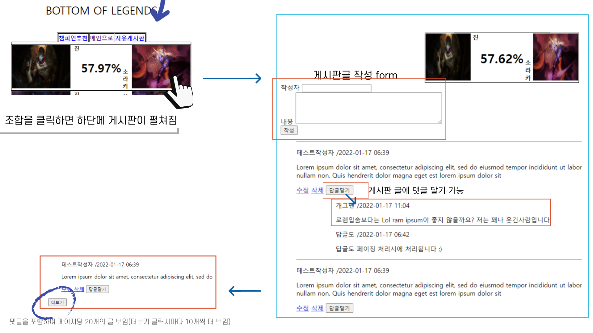

# 이력서


#### 효율화, 최적화를 중시하는 개발자 이연우입니다.

>  한 번 구현에서 끝내지 않고 지속적으로 개선할 수 있는 부분을 찾고 발전시켜나가는 것을 좋아합니다.

이름: 이연우

Email: fox_93@naver.com

GitHub: https://github.com/YeonwooLee

# 사용기술

### Language

- `java` `python`

### BACK-END

- `Spring Boot` `JPA`
- `MVC` `REST API`


### Cloud

- `AWS EC2` `AWS RDS`

# 프로젝트

### [Stock Helper](https://github.com/YeonwooLee/stock_helper)

- 기간: 2023.01 ~ 2023.01

- 개요: 실시간 주식 시황 제공, 개별종목 요약 정보 제공, 주식 리포트 요약 기능 제공

- 참여인원: 2

  - 기획 1, 풀스택 1

- 사용기술: Spring boot, JPA, python

- 주요 기여 내용(역할: 풀스택 )

  - 파이썬 실행 및 번역 모듈 작성

    - 실시간 주식 시황 제공 기능에 사용
    - 파이썬 스크립트를 실행하고, 결과를 자바 객체로 파싱

  - pdf 요약 기능 개발

    - 주식 리포트 요약 기능 구현에 사용
    - pdf 문서에서 원하는 키워드를 포함한 문단만 추출

  - 크롤러

    - 개별 종목 요약 정보 제공에 사용

    - 추상화 하여 여러 페이지 크롤링이 용이하도록 개발

    - movePage(): 크롤링 할 페이지로 이동

    - crawling(): 실제 크롤링 작업

      ```java
      @Component
      @RequiredArgsConstructor
      public abstract class Crawler<T> {
          public final ChromeOptions chromeOption;//싱글톤 크롬옵션
          public final WebDriver driver;//싱글톤 드라이버
      
          public final String url;
          public final String xpathOfElementGroup;
      
      
          public abstract void movePage();
      
          public abstract T crawling();
      
      
      }
      ```

      


### [My Trip Route](https://github.com/YeonwooLee/myTripRoute)

- 기간: 2023.05 ~ 2022.05
- 개요: 여행지 추천, 여행 일정 관리, 커뮤니티 서비스
- 참여인원: 2
  - 풀스택 2

- 사용기술: Spring boot, REST API, Mybatis, Vue.js
- 주요 기여 내용(역할: 풀스택)
  - 카카오 지도 기반 관광지 검색 기능 개발		
  - ​	여행 일정 관리 기능 개발	


### [BOL - Bottom Of Legends](https://github.com/YeonwooLee/allwinrate)

- 기간: 2022.01 ~ 2022.01
- 개요: 인기 게임 리그오브 레전드의 승률 상위 캐릭터 조합 추천 및 커뮤니티 서비스
- 참여인원: 1
  - 풀스택 1
- 사용기술: Spring boot, REST API, Mybatis, AWS EC2, AWS RDS
- 주요 기여 내용(역할: 풀스택)
  - 캐릭터 추천 기능, 커뮤니티 기능, 카카오톡 소셜 로그인





### [롤 포지션 분류 알고리즘](http://www.google.co.kr)

- 기간: 2019.11 ~ 2019.11
- 개요: 시간대별 캐릭터 위치 기반 포지션 분류 알고리즘
- 참여인원: 1
- 사용기술: Python, Riot API
- 주요 기여 내용
  - 포지션 분류 알고리즘 작성, 원격 api_key 갱신 기능


### 관공서 모니터링

- 기간: 2019.11 ~ 2019.11

- 개요: 120개 관공서 크롤링하여 특정 키워드를 포함한 게시글 등록시 모바일 메신저로 알림

- 참여인원: 1

- 사용기술: Python

- 주요 기여 내용

  - 크롤러 매니저 구현

    - 등록된 크롤러 순회하면서 실행
    - 각종 에러발생시 프로그램 유지

  - 120개 페이지 크롤러 작성

    - 페이지 유형에 따른 크롤링 진행
    - 추상화 하여 페이지 추가 작업을 간략화
    - `<canvas>` 등 문자열 추출이 어려운 태그 기반 페이지는 페이지 하루 1회 스크린샷을 전송

    

  - 에러관리

    - 모니터링 중 에러 발생 시 해당 내용 db에 저장 및 메신저 알림

    

    

    
